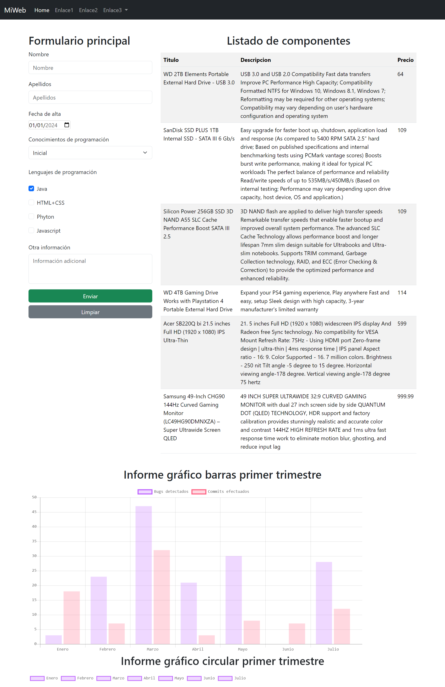

# Práctica 5.6 Uso de APIs web y creación de informes gráficos

## Parte 1

Utiliza una API para rellenar el contenido de la tabla de la web en Bootstrap creada en el apartado en las prácticas anteriores. Ayúdate de las instrucciones vistas en relación a la instrucción *fetch* en Javascript.

## Parte 2

Agrega elementos gráficos mediante la librería **chart.js** para crear un informe gráfico de los datos de la tabla o con los datos que decidas.

## Parte 3 (opcional)

Agrega controladores a la tabla generada por la API anterior para tener funciones adicionales como guardar en PDF, modificar, etc.
